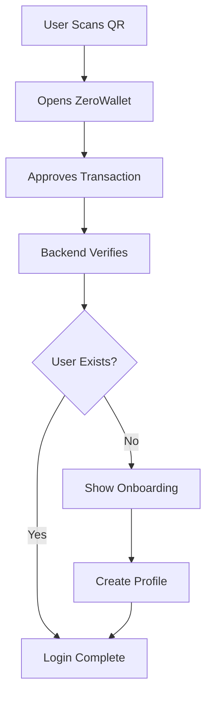

# @zerocat-software/zerobrix-auth


A modern, secure, and easy-to-use authentication solution for Next.js applications using ZeroBrix wallet. Perfect for projects that need blockchain-based authentication without the complexity.

[](https://www.npmjs.com/package/@zerocat-software/zerobrix-auth)
[](https://opensource.org/licenses/BSD-3-Clause)

## Why ZeroBrix Auth?

ZeroBrix Auth brings enterprise-grade blockchain authentication to your Next.js application with minimal setup. While ZeroBrix Blockchain is our proprietary solution for secure transactions, this authentication library is fully open-source, allowing developers to:

- ✅ Inspect and verify the security implementation
- ✅ Contribute improvements and features
- ✅ Customize the solution for specific needs
- ✅ Trust the authentication process through transparency

The open-source nature of this library, combined with ZeroBrix's secure blockchain infrastructure, provides the perfect balance of security and trustworthiness for modern web applications.

## Features

- 🎨 **Modern UI**: Sleek frosted glass design with smooth animations
- 🔐 **Secure Authentication**: Blockchain-based with QR code scanning
- 📱 **Mobile-First**: Optimized for ZeroWallet mobile app interaction
- 🔄 **Flexible Onboarding**: Support for both individual and company accounts
- 💾 **Built-in Database**: Encrypted JSON storage included
- ⚡ **Next.js Ready**: Works seamlessly with App Router and Pages Router
- 🎯 **Zero Config**: No complex setup required
- 🎨 **Customizable**: Easy theming and styling options
- 🌐 **TypeScript**: Full type safety and autocompletion

## Quick Start

### 1. Installation

```bash
# Using npm
npm install @zerocat-software/zerobrix-auth

# Using yarn
yarn add @zerocat-software/zerobrix-auth

# Using pnpm
pnpm add @zerocat-software/zerobrix-auth
```

### 2. Environment Setup

Create or update your `.env.local` file:

```env
# ZeroBrix API Configuration
ZEROBRIX_API_URL=https://brix.zerocat.one/api/v2
ZEROBRIX_API_KEY=your_api_key
AUTH_CONTRACT_ID=your_contract_id

# Public Variables (Accessible in browser)
NEXT_PUBLIC_SERVER_WALLET_ADDRESS=your_wallet_address
NEXT_PUBLIC_ZEROCOIN_TOKEN_ID=your_token_id

# Optional: Custom encryption key for database
DB_ENCRYPTION_KEY=your_random_32_byte_hex_string
```

### 3. Add the Provider

In your app's root layout (`app/layout.tsx`):

```tsx
import { AuthProvider } from '@zerocat-software/zerobrix-auth';

export default function RootLayout({
  children
}: {
  children: React.ReactNode
}) {
  return (
    <html>
      <body>
        <AuthProvider
          config={{
            appName: "My Amazing App",
            appDescription: "Secure login with ZeroWallet",
            theme: {
              primary: "blue",
              secondary: "teal"
            }
          }}
        >
          {children}
        </AuthProvider>
      </body>
    </html>
  );
}
```

### 4. Protect Your Routes

Simply wrap any component that needs authentication:

```tsx
'use client';

import { withAuth, useAuth } from '@zerocat-software/zerobrix-auth';

function DashboardPage() {
  const { user } = useAuth();
  
  return (
    <div>
      <h1>Welcome, {user?.first_name || user?.company_name}!</h1>
      <p>Your wallet: {user?.wallet_address}</p>
    </div>
  );
}

// This adds authentication protection
export default withAuth(DashboardPage);
```

That's it! The library handles everything else automatically.

## How It Works

Let's break down the authentication flow:

### 1. Initial State
When a user visits a protected page, the library checks for existing authentication. If none is found, it automatically shows the auth modal.

### 2. QR Code Generation
```tsx
// This happens automatically, but here's what's going on:
const qrData = await fetch('/api/auth').then(r => r.json());
```
- A unique nonce is generated
- QR code is created with transaction details
- User sees the QR code in the modal

### 3. Authentication Flow


### 4. User Management
The library includes an encrypted JSON database that automatically handles:
- User creation
- Profile updates
- Secure storage
- Data encryption

Example of accessing user data:
```tsx
function ProfilePage() {
  const { user, logout } = useAuth();
  
  return (
    <div>
      <h2>Profile</h2>
      {user?.company_name ? (
        // Company Profile
        <div>
          <p>Company: {user.company_name}</p>
          <p>Role: {user.role}</p>
        </div>
      ) : (
        // Individual Profile
        <div>
          <p>Name: {user.first_name} {user.last_name}</p>
          <p>Email: {user.email}</p>
        </div>
      )}
      <button onClick={logout}>Logout</button>
    </div>
  );
}

export default withAuth(ProfilePage);
```

## Advanced Configuration

### Custom Styling

You can customize the appearance:

```tsx
<AuthProvider
  config={{
    // Color theme
    theme: {
      primary: "indigo",
      secondary: "purple"
    },
    
    // Custom styles
    customStyles: {
      card: "shadow-2xl border-white/10",
      button: "hover:scale-105 transition-all",
      input: "focus:ring-2 focus:ring-purple-500"
    },
    
    // Custom logo
    logo: {
      src: "/your-logo.png",
      width: 120,
      height: 40
    }
  }}
>
```

### Onboarding Options

Configure the user registration flow:

```tsx
<AuthProvider
  config={{
    onboardingFields: {
      // Allow company registration
      allowCompany: true,
      
      // Make fields required
      requireName: true,
      requireEmail: true,
      
      // Custom roles
      availableRoles: [
        "User",
        "Admin",
        "Developer",
        "Manager"
      ]
    }
  }}
>
```

### Custom Validation

Add custom validation logic:

```tsx
// app/api/auth/route.ts
import { createAuthApiHandler } from '@zerocat-software/zerobrix-auth';

export const { GET, POST } = createAuthApiHandler({
  async customValidation(walletAddress: string) {
    // Example: Check if wallet is whitelisted
    const whitelist = ['0x123...', '0x456...'];
    return whitelist.includes(walletAddress);
  }
});
```

## Security Considerations

### Database Encryption
The JSON database is automatically encrypted using AES-256-GCM:
- Encryption key is securely generated during installation
- Data is encrypted at rest
- Each write operation uses a new IV
- Authentication tags prevent tampering

### Authentication Flow Security
- Nonces are single-use and time-limited
- All API routes are rate-limited
- Wallet addresses are verified on-chain
- User data is encrypted in transit and at rest

## Troubleshooting

### Common Issues

1. "Modal not showing on protected page"
```tsx
// Make sure you've wrapped the page with withAuth
export default withAuth(YourPage);

// And added 'use client' directive
'use client';
import { withAuth } from '@zerocat-software/zerobrix-auth';
```

2. "Styling not working"
```js
// Add to tailwind.config.js
module.exports = {
  content: [
    // ... other paths
    "./node_modules/@zerocat-software/zerobrix-auth/**/*.{js,ts,jsx,tsx}"
  ]
}
```

3. "Database errors"
```bash
# Ensure data directory exists and is writable
mkdir -p data
chmod 755 data
```

## Contributing

We welcome contributions! This library is open source to foster community involvement and trust. While ZeroBrix Blockchain itself is proprietary, we believe in transparent authentication implementations.

1. Fork the repository
2. Create your feature branch (`git checkout -b feature/amazing-feature`)
3. Commit your changes (`git commit -m 'Add amazing feature'`)
4. Push to the branch (`git push origin feature/amazing-feature`)
5. Open a Pull Request

## Support

- 📚 [Documentation](https://docs.zerocat.one/auth)
- 💬 [Discord Community](https://discord.gg/zerocat)
- 🐛 [Issue Tracker](https://github.com/zerocat-software/zerobrix-auth/issues)
- 📧 [Email Support](mailto:support@zerocat.one)

## License

Licensed under the BSD-3-Clause License. See [LICENSE](./LICENSE) for more information.

---

<div align="center">
Made with ❤️ by ZEROCAT

[zerocat.one](https://www.zerocat.art) • [LinkedIn](https://linkedin.com/company/zerocat) • [Blog](https://www.zerocat.one/journal)
</div>